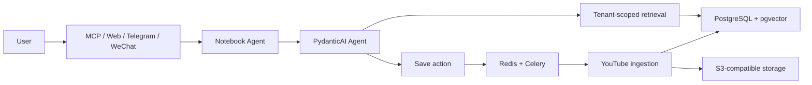

# Notebook Agent

[English](README.md) | [简体中文](README.zh-CN.md)

> Your private knowledge, available wherever you chat.

Notebook Agent turns saved YouTube videos into a private, searchable knowledge
library. Ask in natural language through MCP, the browser application, or an
optional Telegram/WeChat bridge; answers are grounded in retrieved excerpts
and timestamped source links.

**EAZO Global Hackathon Project**

## What it does

1. Save an explicit YouTube URL.
2. Fetch its metadata and captions asynchronously, archive the source, split
   it into semantic chunks, and index embeddings.
3. Ask a question in your own knowledge space.
4. Receive an evidence-backed answer with the original video location.

YouTube is the only end-to-end ingestion connector currently supported.
Bilibili and WeChat articles are represented in the data model, but their
connectors are not available yet.

## Highlights

| Area | Capability |
| --- | --- |
| Retrieval | Hybrid PostgreSQL full-text and pgvector search, with citations restricted to retrieved evidence. |
| Privacy | Tenant-scoped data access; model tools never receive a user ID to choose another tenant. |
| Ingestion | Redis/Celery background processing, S3-compatible raw archive, idempotent dispatch, and recoverable completion notifications. |
| Interfaces | Standard MCP 2.0 over stdio or Streamable HTTP, plus an optional same-origin browser application with email login. |
| Channels | Optional LangBot bridge for Telegram and WeChat, including single-use cross-channel identity-linking codes. |
| Library | Tenant-scoped inventory, notes, soft delete/restore, retry, and scheduled bounded purge. |

## Quick start

### Prerequisites

- Python 3.11+
- Docker and Docker Compose
- An Agent-model credential and a Zhipu Embedding API credential

The managed launcher requires Linux or macOS. On Windows, use the direct
commands in the deployment guide instead.

### Start a read-only local MCP runtime

```bash
git clone YOUR_REPOSITORY_URL
cd notebook-agent

python -m venv .venv
source .venv/bin/activate
python -m pip install -e '.[dev]'

# Creates an ignored .env.runtime and asks only for the required provider keys.
./scripts/notebook-agent init --profile read
./scripts/notebook-agent start
```

`read` starts Streamable HTTP MCP without background ingestion. Select `full`
when you also need Redis, MinIO, a worker, Beat, and the private LangBot
gateway. Select `langbot` for that background/channel stack without MCP.

```bash
./scripts/notebook-agent status
./scripts/notebook-agent logs mcp
./scripts/notebook-agent stop
```

Issue a scoped grant before connecting an MCP client. Use `read` for questions
and inventory; `full` is required for ingestion and other mutations.

```bash
.venv/bin/python -m app.cli mcp-grant issue \
  --user-id <user-id> --scope read --label local-client
```

For a local stdio client, pass the displayed raw token only to that client
process. For Streamable HTTP, the launcher serves `/mcp` on loopback by
default; place public access behind TLS and send the token in an
`Authorization: Bearer` header. The full first-run sequence and configuration
profiles are in [Getting started](docs/getting-started/README.md).

## Choose your path

- **Configure a local runtime:** [Getting started](docs/getting-started/README.md)
- **Connect an MCP client or browser app:** [Interfaces](docs/interfaces/README.md)
- **Add Telegram or WeChat with LangBot:** [Integrations](docs/integrations/README.md)
- **Deploy, upgrade, back up, or troubleshoot:** [Deployment](docs/deployment/README.md)
- **Find a specific guide:** [Documentation index](docs/README.md)

## Architecture



## Repository map

```text
app/            Core agent, channels, retrieval, ingestion, APIs, and CLI
web/            Browser application
integrations/   Optional LangBot bridge and its security patch
docs/           Layered user, interface, integration, and deployment guides
evals/          Opt-in real-model evaluation suite
tests/          Unit, integration, security, and PostgreSQL tests
```

## Verify a checkout

```bash
pytest -q
.venv/bin/alembic current
.venv/bin/alembic check
```

Run migration downgrade tests only against a disposable PostgreSQL database;
never against normal local data or production.

---

Built for the **EAZO Global Hackathon** — turning scattered saved content into
a private, searchable memory.
