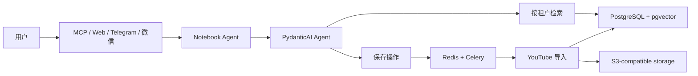

# Notebook Agent

[English](README.md) | [简体中文](README.zh-CN.md)

> 让你的私人知识，在每一个聊天入口触手可及。

Notebook Agent 会把已保存的 YouTube 视频转换为私有、可检索的知识库。你可以通过 MCP、浏览器应用，或可选的 Telegram/微信桥接用自然语言提问；回答只基于检索到的原文片段，并附带可跳转的视频时间戳。

**EAZO Global Hackathon Project**

## 它能做什么

1. 保存一个明确的 YouTube 链接。
2. 在后台获取元数据和字幕，归档原始内容、按语义切分并建立向量索引。
3. 在自己的知识空间内提出问题。
4. 获得带真实证据和原视频位置的回答。

目前只有 YouTube 提供完整的端到端导入能力。数据模型虽已为 Bilibili 和微信公众号文章预留结构，但相应 connector 尚未实现，不能作为当前功能使用。

## 核心能力

| 领域 | 能力 |
| --- | --- |
| 检索 | PostgreSQL 全文检索与 pgvector 语义检索结合；引用只能来自本次检索证据。 |
| 隐私 | 数据严格按租户隔离；模型工具没有可修改或指定其他用户的 `user_id`。 |
| 导入 | Redis/Celery 异步处理、S3-compatible 原文归档、幂等投递与可恢复完成通知。 |
| 接口 | 支持 MCP 2.0 的 stdio / Streamable HTTP，以及带邮箱登录的同源浏览器应用。 |
| 渠道 | 可选 LangBot 桥接 Telegram 与微信，并提供一次性跨渠道身份绑定码。 |
| 资料库 | 支持按租户查看库存、记录保存原因、软删除/恢复、失败重试与定时受限清理。 |

## 快速开始

### 环境要求

- Python 3.11+
- Docker 与 Docker Compose
- 一个 Agent 模型凭据与智谱 Embedding API 凭据

一键生命周期启动器支持 Linux 和 macOS；Windows 请使用部署手册中的直接启动命令。

### 启动只读的本地 MCP

```bash
git clone YOUR_REPOSITORY_URL
cd notebook-agent

python -m venv .venv
source .venv/bin/activate
python -m pip install -e '.[dev]'

# 创建被忽略的 .env.runtime，只询问必要的 provider key。
./scripts/notebook-agent init --profile read
./scripts/notebook-agent start
```

`read` 只启动 Streamable HTTP MCP，不包含后台导入。需要 Redis、MinIO、worker、Beat 和私有 LangBot gateway 时选择 `full`；只需要后台/渠道运行时但不需要 MCP 时选择 `langbot`。

```bash
./scripts/notebook-agent status
./scripts/notebook-agent logs mcp
./scripts/notebook-agent stop
```

连接 MCP 客户端前先签发有范围的 grant。`read` 用于问答和库存浏览；导入等写操作需要 `full`。

```bash
.venv/bin/python -m app.cli mcp-grant issue \
  --user-id <user-id> --scope read --label local-client
```

本地 stdio 客户端只能通过私有进程环境接收命令输出的 raw token。Streamable HTTP 默认在 loopback 的 `/mcp` 提供服务；公网访问必须位于 TLS 后，并使用 `Authorization: Bearer` 传递 token。完整的首次运行步骤和配置组合见[快速入门](docs/getting-started/README.md)。

## 按目标继续阅读

- **配置本地运行时：** [快速入门](docs/getting-started/README.md)
- **接入 MCP 客户端或浏览器应用：** [接口文档](docs/interfaces/README.md)
- **通过 LangBot 接入 Telegram 或微信：** [集成文档](docs/integrations/README.md)
- **部署、升级、备份或排障：** [部署文档](docs/deployment/README.md)
- **查找所有主题：** [文档总览](docs/README.md)

## 系统架构



## 项目结构

```text
app/            Agent、渠道、检索、导入、API 与 CLI 核心
web/            浏览器应用
integrations/   可选 LangBot bridge 与安全补丁
docs/           分层的入门、接口、集成与部署文档
evals/          可选的真实模型评测套件
tests/          单元、集成、安全与 PostgreSQL 测试
```

## 验证

```bash
pytest -q
.venv/bin/alembic current
.venv/bin/alembic check
```

数据库 migration 的 downgrade 验证只能针对临时、可随时丢弃的 PostgreSQL 数据库运行，不能用于日常本地数据或生产环境。

---

Built for the **EAZO Global Hackathon** — turning scattered saved content into a private, searchable memory.
